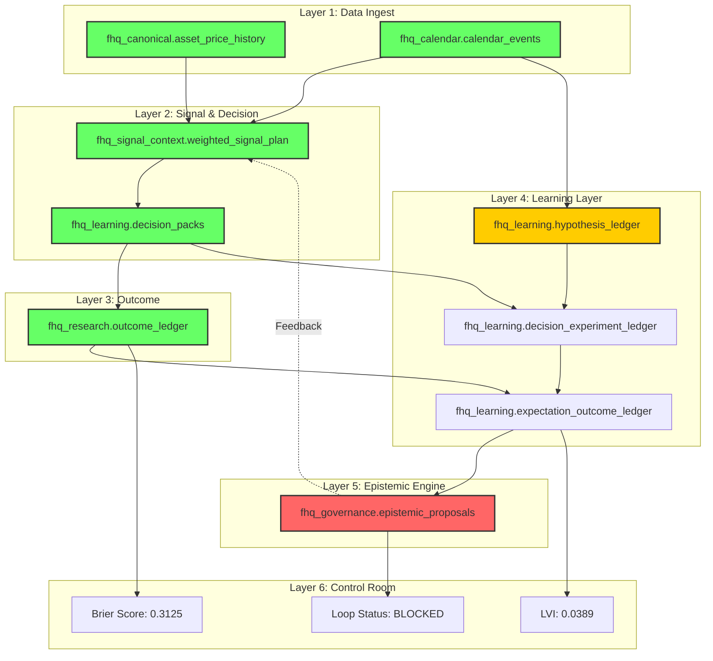

# FjordHQ Learning & Decision Chain - Visual Map

**Directive:** CEO-DIR-2026-VERBAL (Learning Chain Visualization)
**Author:** STIG (EC-003)
**Date:** 2026-01-23
**Purpose:** End-to-end visualization of learning and decision chain for CEO and external auditors

---

## Color Legend

| Color | Status | Meaning |
|-------|--------|---------|
| :green_circle: **GREEN** | ACTIVE | Component operational and producing data |
| :yellow_circle: **YELLOW** | PASSIVE | Component exists but not actively contributing |
| :red_circle: **RED** | BLOCKED | Component missing or non-functional |

---

## End-to-End Learning Chain Diagram

```
┌─────────────────────────────────────────────────────────────────────────────────────────┐
│                           FjordHQ LEARNING & DECISION CHAIN                              │
│                              From Raw Data to Improved Intelligence                       │
└─────────────────────────────────────────────────────────────────────────────────────────┘

╔═══════════════════════════════════════════════════════════════════════════════════════════╗
║  LAYER 1: DATA INGEST                                                                      ║
╠═══════════════════════════════════════════════════════════════════════════════════════════╣
║                                                                                            ║
║  ┌─────────────────────────────────┐     ┌─────────────────────────────────┐              ║
║  │  :green_circle: MARKET DATA                  │     │  :green_circle: EVENTS (IoS-016)            │              ║
║  │  ─────────────────────────────  │     │  ─────────────────────────────  │              ║
║  │  Schema: fhq_canonical          │     │  Schema: fhq_calendar            │              ║
║  │  Tables:                        │     │  Tables:                         │              ║
║  │    • asset_price_history        │     │    • calendar_events (33 upcoming)│             ║
║  │    • intraday_prices            │     │    • event_outcomes               │              ║
║  │  Daemon: alpaca_iex_ingest.py   │     │  Daemon: calendar_integrity.py    │              ║
║  │  Status: 31,236 records         │     │  Status: ACTIVE                   │              ║
║  └─────────────────────────────────┘     └─────────────────────────────────┘              ║
║                    │                                      │                                ║
║                    ▼                                      ▼                                ║
╚════════════════════╪══════════════════════════════════════╪════════════════════════════════╝
                     │                                      │
                     └──────────────┬───────────────────────┘
                                    ▼
╔═══════════════════════════════════════════════════════════════════════════════════════════╗
║  LAYER 2: SIGNAL & DECISION                                                                ║
╠═══════════════════════════════════════════════════════════════════════════════════════════╣
║                                                                                            ║
║  ┌──────────────────────────────────────────────────────────────────────────────────┐     ║
║  │  :green_circle: SIGNAL GENERATION (IoS-013)                                               │     ║
║  │  ──────────────────────────────────────────────────────────────────────────────  │     ║
║  │  Schema: fhq_signal_context                                                       │     ║
║  │  Table: weighted_signal_plan                                                      │     ║
║  │  Daemon: ios013_options_universe_signal_generator.py                              │     ║
║  │  Sources Integrated:                                                              │     ║
║  │    • IoS-002 (Technical) ──┐                                                      │     ║
║  │    • IoS-003 (Regime)    ──┼──► Weighted confidence score                         │     ║
║  │    • IoS-005 (Forecast)  ──┤                                                      │     ║
║  │    • IoS-006 (Macro)     ──┤                                                      │     ║
║  │    • IoS-007 (Causal)    ──┤                                                      │     ║
║  │    • IoS-016 (Events)    ──┘                                                      │     ║
║  │  Status: 44 signals, 97.78% calibrated, 0.00h since last                          │     ║
║  └──────────────────────────────────────────────────────────────────────────────────┘     ║
║                                          │                                                 ║
║                                          ▼                                                 ║
║  ┌──────────────────────────────────────────────────────────────────────────────────┐     ║
║  │  :green_circle: DECISION PACKS                                                            │     ║
║  │  ──────────────────────────────────────────────────────────────────────────────  │     ║
║  │  Schema: fhq_learning                                                             │     ║
║  │  Table: decision_packs                                                            │     ║
║  │  Daemon: decision_pack.py                                                         │     ║
║  │  Status: 20 packs executed                                                        │     ║
║  │  Contents: signal_id, direction, confidence, entry_conditions, risk_params        │     ║
║  └──────────────────────────────────────────────────────────────────────────────────┘     ║
║                                          │                                                 ║
╚══════════════════════════════════════════╪═════════════════════════════════════════════════╝
                                           │
                                           ▼
╔═══════════════════════════════════════════════════════════════════════════════════════════╗
║  LAYER 3: OUTCOME                                                                          ║
╠═══════════════════════════════════════════════════════════════════════════════════════════╣
║                                                                                            ║
║  ┌──────────────────────────────────────────────────────────────────────────────────┐     ║
║  │  :green_circle: OUTCOME LEDGER                                                            │     ║
║  │  ──────────────────────────────────────────────────────────────────────────────  │     ║
║  │  Schema: fhq_research                                                             │     ║
║  │  Table: outcome_ledger                                                            │     ║
║  │  Daemon: ios010_outcome_capture_daemon.py                                         │     ║
║  │  Status: 31,236 outcomes recorded                                                 │     ║
║  │  Contents: decision_pack_id, actual_return, actual_direction, win/loss, pnl       │     ║
║  └──────────────────────────────────────────────────────────────────────────────────┘     ║
║                                          │                                                 ║
╚══════════════════════════════════════════╪═════════════════════════════════════════════════╝
                                           │
                                           ▼
╔═══════════════════════════════════════════════════════════════════════════════════════════╗
║  LAYER 4: LEARNING LAYER                                                                   ║
╠═══════════════════════════════════════════════════════════════════════════════════════════╣
║                                                                                            ║
║  ┌─────────────────────────────────┐     ┌─────────────────────────────────┐              ║
║  │  :yellow_circle: HYPOTHESIS LEDGER           │     │  :yellow_circle: EXPERIMENT LEDGER          │              ║
║  │  ─────────────────────────────  │     │  ─────────────────────────────  │              ║
║  │  Schema: fhq_learning           │     │  Schema: fhq_learning            │              ║
║  │  Table: hypothesis_ledger       │     │  Table: decision_experiment_ledger│             ║
║  │  Daemon: (MISSING - see note)   │     │  Status: Linked to hypotheses     │              ║
║  │  Status: 8 rows (6.67% coverage)│     │  Contents: hypothesis_id,         │              ║
║  │  Contents:                      │     │    decision_pack_id, trade_dir    │              ║
║  │    • event_id                   │     └─────────────────────────────────┘              ║
║  │    • expected_direction         │                      │                                ║
║  │    • expected_magnitude         │                      │                                ║
║  │    • confidence_pre_event       │                      │                                ║
║  │    • immutable_after (event_ts) │                      │                                ║
║  └─────────────────────────────────┘                      │                                ║
║                    │                                      │                                ║
║                    └──────────────┬───────────────────────┘                                ║
║                                   ▼                                                        ║
║  ┌──────────────────────────────────────────────────────────────────────────────────┐     ║
║  │  :yellow_circle: EXPECTATION VS OUTCOME                                                   │     ║
║  │  ──────────────────────────────────────────────────────────────────────────────  │     ║
║  │  Schema: fhq_learning                                                             │     ║
║  │  Table: expectation_outcome_ledger                                                │     ║
║  │  Status: 0 completed experiments                                                  │     ║
║  │  Contents:                                                                        │     ║
║  │    • hypothesis_id ─────────────────────────► Links to pre-event hypothesis       │     ║
║  │    • actual_direction ──────────────────────► What actually happened              │     ║
║  │    • actual_magnitude ──────────────────────► How big was the move                │     ║
║  │    • learning_verdict ──────────────────────► VALIDATED / WEAKENED / FALSIFIED    │     ║
║  │    • evaluation_hours ──────────────────────► Time from event to recording        │     ║
║  └──────────────────────────────────────────────────────────────────────────────────┘     ║
║                                          │                                                 ║
╚══════════════════════════════════════════╪═════════════════════════════════════════════════╝
                                           │
                                           ▼
╔═══════════════════════════════════════════════════════════════════════════════════════════╗
║  LAYER 5: EPISTEMIC ENGINE                                                                 ║
╠═══════════════════════════════════════════════════════════════════════════════════════════╣
║                                                                                            ║
║  ┌──────────────────────────────────────────────────────────────────────────────────┐     ║
║  │  :red_circle: EPISTEMIC PROPOSAL DAEMON                                                   │     ║
║  │  ──────────────────────────────────────────────────────────────────────────────  │     ║
║  │  Schema: fhq_governance                                                           │     ║
║  │  Table: epistemic_proposals                                                       │     ║
║  │  Daemon: epistemic_proposal_daemon.py                                             │     ║
║  │  Status: 0 proposals (BLOCKED - no anomalies detected)                            │     ║
║  │                                                                                   │     ║
║  │  Input Analysis:                                                                  │     ║
║  │    • Outcome patterns ──────────────────────► Detect systematic errors            │     ║
║  │    • Brier scores ──────────────────────────► Identify calibration drift          │     ║
║  │    • Win rates by regime ───────────────────► Spot regime-specific failures       │     ║
║  │                                                                                   │     ║
║  │  Output Proposals:                                                                │     ║
║  │    • Parameter adjustments                                                        │     ║
║  │    • Confidence recalibration                                                     │     ║
║  │    • Model weight changes                                                         │     ║
║  └──────────────────────────────────────────────────────────────────────────────────┘     ║
║                                          │                                                 ║
║                                          │ (When proposals approved)                       ║
║                                          ▼                                                 ║
║  ┌──────────────────────────────────────────────────────────────────────────────────┐     ║
║  │  FEEDBACK TO SIGNAL LAYER                                                         │     ║
║  │  ──────────────────────────────────────────────────────────────────────────────  │     ║
║  │  Approved proposals update:                                                       │     ║
║  │    • IoS-002 technical weights                                                    │     ║
║  │    • IoS-003 regime thresholds                                                    │     ║
║  │    • IoS-013 confidence calibration                                               │     ║
║  │    ──────────────────────────────────► Back to LAYER 2                            │     ║
║  └──────────────────────────────────────────────────────────────────────────────────┘     ║
║                                                                                            ║
╚════════════════════════════════════════════════════════════════════════════════════════════╝

╔═══════════════════════════════════════════════════════════════════════════════════════════╗
║  LAYER 6: CONTROL ROOM FEEDBACK                                                            ║
╠═══════════════════════════════════════════════════════════════════════════════════════════╣
║                                                                                            ║
║  ┌─────────────────────────────────┐     ┌─────────────────────────────────┐              ║
║  │  :green_circle: BRIER SCORE                  │     │  :green_circle: LVI (Learning Velocity)     │              ║
║  │  ─────────────────────────────  │     │  ─────────────────────────────  │              ║
║  │  Schema: fhq_research           │     │  Schema: fhq_ops                 │              ║
║  │  Table: forecast_skill_metrics  │     │  Table: control_room_lvi         │              ║
║  │  View: fhq_ops.v_brier_summary  │     │  Daemon: lvi_calculator.py       │              ║
║  │  Value: 0.3125                  │     │  Value: 0.0389 (F)               │              ║
║  │  Skill Factor: 0.4375           │     │  Bottleneck: Coverage 6.67%      │              ║
║  │                                 │     │                                  │              ║
║  │  Measures:                      │     │  Components:                     │              ║
║  │    • Forecast accuracy          │     │    • Experiment throughput       │              ║
║  │    • Calibration quality        │     │    • Coverage rate               │              ║
║  │    • Confidence reliability     │     │    • Integrity rate              │              ║
║  └─────────────────────────────────┘     │    • Evaluation timeliness       │              ║
║                                          └─────────────────────────────────┘              ║
║                                                                                            ║
║  ┌──────────────────────────────────────────────────────────────────────────────────┐     ║
║  │  :green_circle: LEARNING LOOP STATUS                                                      │     ║
║  │  ──────────────────────────────────────────────────────────────────────────────  │     ║
║  │  Schema: fhq_ops                                                                  │     ║
║  │  View: v_learning_loop_health                                                     │     ║
║  │  Status: BLOCKED                                                                  │     ║
║  │                                                                                   │     ║
║  │  Health Indicators:                                                               │     ║
║  │    • hypothesis_registry: 1 ───────────────► LOW                                  │     ║
║  │    • outcome_ledger: 31,236 ───────────────► OK                                   │     ║
║  │    • decision_packs: 20 ───────────────────► OK                                   │     ║
║  │    • epistemic_proposals: 0 ───────────────► BLOCKED                              │     ║
║  └──────────────────────────────────────────────────────────────────────────────────┘     ║
║                                                                                            ║
╚════════════════════════════════════════════════════════════════════════════════════════════╝
```

---

## Schema-to-Table Reference

| Layer | Schema | Table | Status | Records |
|-------|--------|-------|--------|---------|
| 1 - Data | fhq_canonical | asset_price_history | :green_circle: ACTIVE | 31,236 |
| 1 - Data | fhq_calendar | calendar_events | :green_circle: ACTIVE | 33 upcoming |
| 2 - Signal | fhq_signal_context | weighted_signal_plan | :green_circle: ACTIVE | 44 |
| 2 - Decision | fhq_learning | decision_packs | :green_circle: ACTIVE | 20 |
| 3 - Outcome | fhq_research | outcome_ledger | :green_circle: ACTIVE | 31,236 |
| 4 - Learning | fhq_learning | hypothesis_ledger | :yellow_circle: PASSIVE | 8 (6.67%) |
| 4 - Learning | fhq_learning | decision_experiment_ledger | :yellow_circle: PASSIVE | - |
| 4 - Learning | fhq_learning | expectation_outcome_ledger | :yellow_circle: PASSIVE | 0 |
| 5 - Epistemic | fhq_governance | epistemic_proposals | :red_circle: BLOCKED | 0 |
| 6 - Control | fhq_research | forecast_skill_metrics | :green_circle: ACTIVE | 141 |
| 6 - Control | fhq_ops | control_room_lvi | :green_circle: ACTIVE | 0.0389 |
| 6 - Control | fhq_ops | control_room_alerts | :green_circle: ACTIVE | 2 |

---

## Daemon-to-Table Reference

| Daemon | Reads From | Writes To | Schedule | Status |
|--------|------------|-----------|----------|--------|
| alpaca_iex_ingest.py | Alpaca API | fhq_canonical.asset_price_history | Continuous | :green_circle: |
| calendar_integrity_daemon.py | External APIs | fhq_calendar.calendar_events | Hourly | :green_circle: |
| ios013_options_universe_signal_generator.py | All IoS sources | fhq_signal_context.weighted_signal_plan | 4-hourly | :green_circle: |
| decision_pack.py | weighted_signal_plan | fhq_learning.decision_packs | On signal | :green_circle: |
| ios010_outcome_capture_daemon.py | decision_packs, prices | fhq_research.outcome_ledger | Continuous | :green_circle: |
| **hypothesis_generation_daemon.py** | calendar_events, signals | fhq_learning.hypothesis_ledger | **MISSING** | :red_circle: |
| epistemic_proposal_daemon.py | outcome_ledger | fhq_governance.epistemic_proposals | Hourly | :yellow_circle: |
| lvi_calculator.py | All learning tables | fhq_ops.control_room_lvi | Daily | :green_circle: |
| control_room_alerter.py | All metrics | fhq_ops.control_room_alerts | 15-min | :green_circle: |

---

## Critical Path Analysis

```
┌─────────────────────────────────────────────────────────────────────────────────────┐
│                              CRITICAL PATH TO LEARNING                               │
└─────────────────────────────────────────────────────────────────────────────────────┘

1. :green_circle: Market data flows in         → fhq_canonical.asset_price_history
                    │
2. :green_circle: Events tracked               → fhq_calendar.calendar_events
                    │
3. :green_circle: Signals generated            → fhq_signal_context.weighted_signal_plan
                    │
4. :green_circle: Decisions made               → fhq_learning.decision_packs
                    │
5. :green_circle: Outcomes captured            → fhq_research.outcome_ledger
                    │
6. :red_circle: **BLOCKAGE HERE**             → fhq_learning.hypothesis_ledger (6.67% coverage)
   │                                             Missing: hypothesis_generation_daemon.py
   │
7. :yellow_circle: Experiments incomplete       → fhq_learning.expectation_outcome_ledger
                    │
8. :red_circle: Epistemic engine starved      → fhq_governance.epistemic_proposals = 0
                    │
9. :yellow_circle: LVI degraded                 → 0.0389 (F grade)

═══════════════════════════════════════════════════════════════════════════════════════
BOTTLENECK: Hypothesis coverage rate (6.67%)
SOLUTION: Deploy hypothesis_generation_daemon.py under FINN (EC-004)
═══════════════════════════════════════════════════════════════════════════════════════
```

---

## Data Flow Summary (Mermaid)



---

## Verification Queries

```sql
-- Layer 1: Data Ingest
SELECT 'fhq_canonical.asset_price_history' as surface, COUNT(*) as records FROM fhq_canonical.asset_price_history;
SELECT 'fhq_calendar.calendar_events' as surface, COUNT(*) FILTER (WHERE event_timestamp > NOW()) as upcoming FROM fhq_calendar.calendar_events;

-- Layer 2: Signal & Decision
SELECT 'weighted_signal_plan' as surface, COUNT(*) as records, MAX(created_at) as last FROM fhq_signal_context.weighted_signal_plan;
SELECT 'decision_packs' as surface, COUNT(*) as records FROM fhq_learning.decision_packs;

-- Layer 3: Outcome
SELECT 'outcome_ledger' as surface, COUNT(*) as records FROM fhq_research.outcome_ledger;

-- Layer 4: Learning
SELECT 'hypothesis_ledger' as surface, COUNT(*) as records FROM fhq_learning.hypothesis_ledger;
SELECT 'expectation_outcome_ledger' as surface, COUNT(*) as records FROM fhq_learning.expectation_outcome_ledger;

-- Layer 5: Epistemic
SELECT 'epistemic_proposals' as surface, COUNT(*) as records FROM fhq_governance.epistemic_proposals;

-- Layer 6: Control Room
SELECT * FROM fhq_ops.v_control_room_dashboard;
```

---

## Audit Trail

| Timestamp | Action | Evidence |
|-----------|--------|----------|
| 2026-01-23T19:13 | Signal generation | IOS013_OPTIONS_UNIVERSE_FULL_20260123_191351.json |
| 2026-01-23T19:17 | LVI computation | LVI_COMPUTATION_20260123_201724.json |
| 2026-01-23T19:18 | Alert check | control_room_alerts table |

---

**Signed:** STIG (EC-003)
**Timestamp:** 2026-01-23T20:25:00.000Z
**Classification:** GOVERNANCE-CRITICAL / AUDIT-GRADE
