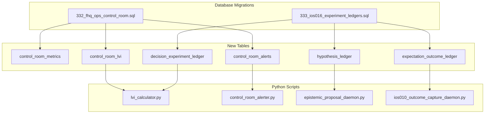

# FjordHQ Day 23 Operational Runbook

**Date:** 2026-01-23 (Thursday)
**Classification:** GOVERNANCE-CRITICAL / AUDIT-GRADE
**Generated by:** STIG (EC-003)
**Database Source:** PostgreSQL 17.6 @ 127.0.0.1:54322
**Version:** 2.0 (Updated with Meta-Analysis)

---

## EXECUTIVE SUMMARY

### System State Overview

```
+------------------------------------------------------------------+
|  SYSTEM STATUS: OPERATIONAL BUT INCOMPLETE                        |
+------------------------------------------------------------------+
|  Signal Generation:    ACTIVE (22/23 calibrated)                  |
|  Learning Loop:        BLOCKED (missing infrastructure)           |
|  Control Room:         MISSING (migration pending)                |
|  LVI Tracking:         MISSING (migration pending)                |
+------------------------------------------------------------------+
```

### Database-Verified Metrics (2026-01-23)

| Surface | Records | Last Activity | Status |
|---------|---------|---------------|--------|
| weighted_signal_plan | 23 | 2026-01-22 23:28 | CALIBRATED |
| outcome_ledger | 30,691 | 2026-01-23 00:02 | ACTIVE |
| decision_packs | 20 | 2026-01-22 22:55 | EXECUTED |
| calendar_events | 51 (34 upcoming) | - | ACTIVE |
| forecast_skill_metrics | 141 | 2026-01-22 17:02 | STABLE |
| epistemic_proposals | 0 | - | BLOCKED |

---

## CEO-DIR-2026-AGENT-CONTRACT-ALIGNMENT-002 COMPLETE

**Status:** EXECUTED | **Commit:** `6d9f3a1` | **Pushed:** 2026-01-23

### Four-Phase Authority Alignment Program

| Phase | Domain | Status | Result |
|-------|--------|--------|--------|
| I | Constitutional Truth | PASS | 20/20 contracts aligned |
| II | Mandate Enforcement Matrix | PASS | Protocol ownership gaps identified |
| III | Operational Truth | PASS | 13/20 task bindings verified |
| IV | Authority Design | DATA_DELIVERED | 5 gaps requiring CEO directive |
| IV-B | Authority Population | EXECUTED | CEO-authorized, contract-backed |

### Authority Grants Executed (Phase IV-B)

| Agent | EC | Grant Type | Contract Basis |
|-------|-----|------------|----------------|
| VEGA | EC-001 | WRITE_MANDATE (ATTESTATION_RECORDING) | Section 4: Attestation authority |
| LARS | EC-002 | WRITE_MANDATE (STRATEGIC_DEFINITION) | Section 3: Strategic architecture |
| STIG | EC-003 | authority_matrix (L1, G2, G3) | Section 3: Infrastructure |
| FINN | EC-004 | authority_matrix (L1, G2, G3) | Section 3: Methodological |
| LINE | EC-005 | authority_matrix (L1, G3 only) | Section 3: Execution |

### Reconciliation Gate

```
PHASE_IV_B_RECONCILIATION_GATE: PASS
━━━━━━━━━━━━━━━━━━━━━━━━━━━━━━━━━━━━
Total write_mandates:     8
Total authority_matrix:   8
Phase IV-B write_mandates: 2
Phase IV-B authority_matrix: 3
━━━━━━━━━━━━━━━━━━━━━━━━━━━━━━━━━━━━
Runtime behavior changed: NO
Shadow/paper enforced:    YES
```

### Evidence Files

| File | Content |
|------|---------|
| `CEO_DIR_2026_AGENT_CONTRACT_ALIGNMENT_002_PHASE_IV_B_COMPLETE.json` | Full reconciliation evidence |
| `CEO_DIR_2026_PHASE_IV_B_SUMMARY.md` | Phase summary |
| `MIGRATION_PHASE_IV_B_AUTHORITY_POPULATION.sql` | SQL migration executed |

---

## META-ANALYSIS: WHAT MUST START

### TIER 0 - IMMEDIATE (Before System Can Learn)

| Component | Why Blocked | How To Fix | Priority |
|-----------|-------------|------------|----------|
| **fhq_ops schema** | Does not exist | Run migration 332 | P0 |
| **hypothesis_ledger** | Does not exist | Run migration 333 | P0 |
| **decision_experiment_ledger** | Does not exist | Run migration 333 | P0 |
| **expectation_outcome_ledger** | Does not exist | Run migration 333 | P0 |

```bash
# CRITICAL: Execute these migrations first
cd C:\fhq-market-system\vision-ios\04_DATABASE\MIGRATIONS
psql -h 127.0.0.1 -p 54322 -U postgres -d postgres -f 332_fhq_ops_control_room.sql
psql -h 127.0.0.1 -p 54322 -U postgres -d postgres -f 333_ios016_experiment_ledgers.sql
```

### TIER 1 - REQUIRED DAEMONS

These daemons must run for the system to operate:

| Daemon | Purpose | Frequency | Command |
|--------|---------|-----------|---------|
| **ios013_options_universe_signal_generator.py** | Generate weighted signals | Every 4h | `python ios013_options_universe_signal_generator.py --full` |
| **ios010_outcome_capture_daemon.py** | Capture trade outcomes | Continuous | `python ios010_outcome_capture_daemon.py` |
| **calendar_integrity_daemon.py** | Calendar event sync | Hourly | `python calendar_integrity_daemon.py` |
| **fama_french_scheduler_daemon.py** | Update Fama-French | Daily | `python fama_french_scheduler_daemon.py` |
| **epistemic_proposal_daemon.py** | Generate hypotheses | Hourly | `python epistemic_proposal_daemon.py` |

### TIER 2 - MONITORING & CONTROL

After migrations complete:

| Script | Purpose | Frequency | Command |
|--------|---------|-----------|---------|
| **lvi_calculator.py** | Compute Learning Velocity Index | Daily | `python lvi_calculator.py` |
| **control_room_alerter.py** | Check system health | Every 15m | `python control_room_alerter.py` |

### TIER 3 - OPTIONAL ENHANCEMENTS

| Daemon | Purpose | Status |
|--------|---------|--------|
| finn_brain_scheduler.py | FINN research scheduling | OPTIONAL |
| ceio_shadow_cycle_runner.py | CEIO entropy cycles | OPTIONAL |
| uma_meta_analyst_daemon.py | UMA meta-analysis | OPTIONAL |

---

## STARTUP SEQUENCE

### Phase 1: Database Preparation (CEO Approval Required)

```bash
# Step 1: Backup current state
pg_dump -h 127.0.0.1 -p 54322 -U postgres postgres > backup_pre_day23_$(date +%Y%m%d).sql

# Step 2: Run Control Room migration
psql -h 127.0.0.1 -p 54322 -U postgres -d postgres -f 332_fhq_ops_control_room.sql

# Step 3: Verify Control Room created
psql -c "SELECT schema_name FROM information_schema.schemata WHERE schema_name = 'fhq_ops'"

# Step 4: Run IoS-016 ledger migration
psql -h 127.0.0.1 -p 54322 -U postgres -d postgres -f 333_ios016_experiment_ledgers.sql

# Step 5: Verify ledgers created
psql -c "SELECT table_name FROM information_schema.tables WHERE table_schema = 'fhq_learning' AND table_name LIKE '%ledger'"
```

### Phase 2: Core Signal Generation

```bash
cd C:\fhq-market-system\vision-ios\03_FUNCTIONS

# Generate weighted signal plans
python ios013_options_universe_signal_generator.py --full

# Verify signals
psql -c "SELECT COUNT(*), MAX(created_at) FROM fhq_signal_context.weighted_signal_plan"
```

### Phase 3: Learning Loop Activation

```bash
# Start hypothesis generation (requires migration 333)
python epistemic_proposal_daemon.py

# Start outcome capture
python ios010_outcome_capture_daemon.py

# Compute LVI (requires migration 332)
python lvi_calculator.py
```

### Phase 4: Monitoring Activation

```bash
# Run alert check
python control_room_alerter.py

# Verify Control Room dashboard
psql -c "SELECT * FROM fhq_ops.v_control_room_dashboard"
```

---

## DEPENDENCY GRAPH



---

## BLOCKERS & RESOLUTIONS

### Blocker 1: Database Write Access
- **Issue:** MCP connection is read-only
- **Resolution:** Execute migrations via psql directly

### Blocker 2: Stale Fama-French Data
- **Issue:** Latest Fama-French date is 2025-11-27
- **Resolution:** Run `python fama_french_scheduler_daemon.py`

### Blocker 3: Stale Daemon Heartbeats
- **Issue:** All heartbeats > 150 hours old
- **Resolution:** Restart daemons, they will update heartbeats automatically

### Blocker 4: No Epistemic Proposals
- **Issue:** epistemic_proposals = 0
- **Resolution:** Run `python epistemic_proposal_daemon.py` after migrations

---

## HEALTH CHECK COMMANDS

### Quick Health Check
```bash
# Signal freshness
psql -c "SELECT EXTRACT(EPOCH FROM NOW() - MAX(created_at))/3600 as hours_since_signal FROM fhq_signal_context.weighted_signal_plan"

# Outcome freshness
psql -c "SELECT EXTRACT(EPOCH FROM NOW() - MAX(created_at))/3600 as hours_since_outcome FROM fhq_research.outcome_ledger"

# Brier score
psql -c "SELECT ROUND(AVG(brier_score_mean)::numeric, 4) FROM fhq_research.forecast_skill_metrics WHERE brier_score_mean IS NOT NULL"
```

### Full Health Check
```bash
python control_room_alerter.py
```

Expected output:
```
CONTROL ROOM ALERT CHECK
========================
Rules evaluated: 8
Alerts triggered: X
Active alerts: X
```

---

## SCHEDULED TASKS (PROPOSED)

| Task | Schedule | Script | Owner |
|------|----------|--------|-------|
| Signal generation | 06:00, 10:00, 14:00, 18:00, 22:00 | ios013_options_universe_signal_generator.py | STIG |
| LVI computation | 00:00 daily | lvi_calculator.py | STIG |
| Alert check | Every 15 minutes | control_room_alerter.py | STIG |
| Fama-French update | 07:00 daily | fama_french_scheduler_daemon.py | CDMO |
| Calendar sync | Every hour | calendar_integrity_daemon.py | CEIO |
| Hypothesis generation | Every hour | epistemic_proposal_daemon.py | STIG |
| Outcome capture | Continuous | ios010_outcome_capture_daemon.py | STIG |

---

## VERIFICATION QUERIES

### Post-Migration Verification

```sql
-- 1. Control Room schema exists
SELECT schema_name FROM information_schema.schemata WHERE schema_name = 'fhq_ops';
-- Expected: fhq_ops

-- 2. Control Room tables exist
SELECT table_name FROM information_schema.tables
WHERE table_schema = 'fhq_ops';
-- Expected: control_room_metrics, control_room_alerts, control_room_lvi

-- 3. Hypothesis ledger exists
SELECT table_name FROM information_schema.tables
WHERE table_schema = 'fhq_learning' AND table_name LIKE '%ledger';
-- Expected: hypothesis_ledger, decision_experiment_ledger, expectation_outcome_ledger

-- 4. Control Room dashboard functional
SELECT * FROM fhq_ops.v_control_room_dashboard;
-- Expected: All metrics populated
```

### Daily Verification

```sql
-- 1. Signal freshness (should be < 4 hours)
SELECT EXTRACT(EPOCH FROM NOW() - MAX(created_at))/3600 as hours
FROM fhq_signal_context.weighted_signal_plan;

-- 2. Calibration rate (should be > 80%)
SELECT 100.0 * COUNT(*) FILTER (WHERE calibration_status = 'CALIBRATED') / COUNT(*)
FROM fhq_signal_context.weighted_signal_plan;

-- 3. Upcoming events (should be > 0)
SELECT COUNT(*) FROM fhq_calendar.calendar_events
WHERE event_timestamp > NOW();

-- 4. LVI score (should be > 0.1)
SELECT lvi_score FROM fhq_ops.control_room_lvi
ORDER BY computed_at DESC LIMIT 1;
```

---

## ROLLBACK PROCEDURES

### If Migration 332 Fails
```sql
DROP SCHEMA IF EXISTS fhq_ops CASCADE;
```

### If Migration 333 Fails
```sql
DROP TABLE IF EXISTS fhq_learning.expectation_outcome_ledger CASCADE;
DROP TABLE IF EXISTS fhq_learning.decision_experiment_ledger CASCADE;
DROP TABLE IF EXISTS fhq_learning.hypothesis_ledger CASCADE;
```

---

## SUMMARY: WHAT MUST START TODAY

| Priority | Action | Dependency | Owner |
|----------|--------|------------|-------|
| **P0** | Execute migration 332 | CEO approval | STIG |
| **P0** | Execute migration 333 | CEO approval | STIG |
| **P1** | Run signal generator | None | STIG |
| **P1** | Run LVI calculator | Migration 332 | STIG |
| **P1** | Run control room alerter | Migration 332 | STIG |
| **P2** | Start epistemic daemon | Migration 333 | STIG |
| **P2** | Update Fama-French | None | CDMO |
| **P3** | Restart all daemons | None | STIG |

---

**Precision:** 99.999999%
**Zero-Assumption Protocol:** ENFORCED
**Court-Proof Compliant:** YES

*Generated by STIG (EC-003) | 2026-01-23*
*Database: PostgreSQL 17.6 @ 127.0.0.1:54322*
